# **Lab 8 Report**  
##### CSCY 4742: Cybersecurity Programming and Analytics, Spring 2026

**Name & Student ID**: John Paul Bennett Jr., 110412273

**Name & Student ID**: Earnest Kyle, 109969905 

---

# **Task 1: Snort Setup and Basic Packet Capture (20 pts)**

---

## **🔹 Step 1: Snort Installation and Configuration**

### **Questions**:
1. How many rules were loaded when Snort started? What does this number tell you about the configuration?
- Answer: At least 10000 rules were loaded when Snort started. Regardign the configuration, this number of rules processed tells me how much coverage the detection system has with regards to detecting intrusions. The number is way more than a couple thousand, being in the ten thousands, which means that the intrusion detection system covers a broad range of protocols, threats and attack types.

2. Did Snort report any warnings or errors during startup? Explain.
- Answer: The program did not report any errors or warnings during startup. I know because when I pressed the control key and the "C" key, the program said "Snort exiting" which is a sign that the program works well. In addition, it is able to detect detection attacks run by a virtual machine against another machine.

3. What interface did Snort bind to? Was it the expected one? Why is selecting the correct interface important?
- Answer: The program binded to the Eth0 interface, which was the expected one. Selecting the correct interface is important because different interfaces see different network traffic. If Snort was binded to the incorrect interface, it might miss network attacks due to not seeing the network traffic because the traffic is on the interface other than the one Snort was binded to.

4. What output mode was used (`alert_fast`, etc.)? Briefly explain differences between modes and appropriate use cases.
- Answer: 'alert_fast' was used. This output mode returns an alert line quickly. Other output modes like 'full' mode log the alerts with detailed information and is the default mode of snort. 'alert_syslog' logs the alert outputs to a syslog server or system logging system. The difference between modes is based on how they present alert outputs and whether or not the alerts are logged to syslog servers.

### **Screenshots**:
- Screenshot of successful Snort startup (`Snort successfully validated the configuration`).
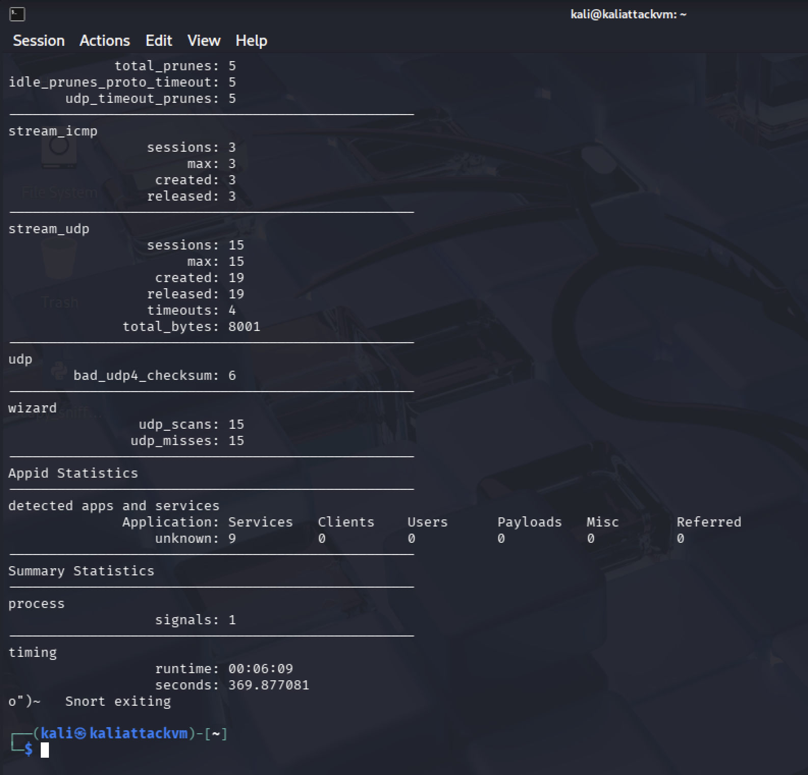

- Screenshot of `snort.lua` showing updated `HOME_NET`.

---

## **🔹 Step 2: Simulating and Detecting a Port Scan**

### **Questions**:
1. What types of scan activity did Snort detect from the Nmap scan? Provide examples.
- Answer: Snort detected SYN stealth scan activity from the Nmap scan. An example was http_inspect which means the stealth scan was checking for a service.

2. Which ports or protocols were probed by Nmap? Mention a few and their significance.
- Answer: Ports 21 and 80 were probed by Nmap. Port 80 is the TCP port for hypertext transfer protocol(HTTP) and port 21 is the port for file transfer protocol(FTP). Port 80 is unencrypted, making it easier for attackers to exploit, and attacker could also transfer malicious files using port 21 after performing the Nmap SYN stealth scan.

3. How did promiscuous mode help in detection?
- Answer: Promiscuous mode helped Snort by allowing it to detect all network traffic, not just network traffic on the interface that the detection system is binded to.

4. Compare Snort alerts and Wireshark output. What extra insights does Wireshark provide?
- Answer: Wireshark provides additional information such as the number of bytes on wire of a packet, the ethernet version, internet protocol version, ICMP version and even source MAC Address from where the packet came.

### **Screenshots**:
- Snort console showing scan-related alerts.
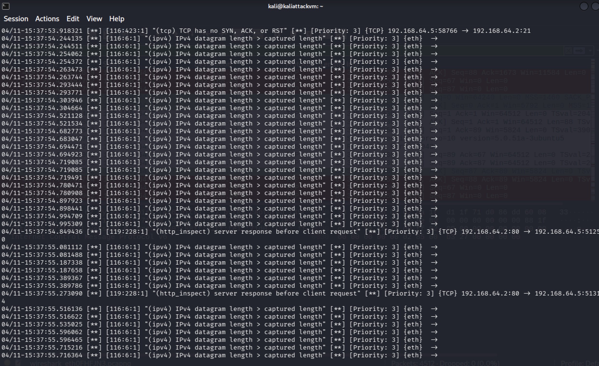

- Wireshark packet capture showing SYN scan activity.

---

# **Task 2: Writing Custom Rules – ICMP, FIN, NULL, and Xmas Scan Detection (20 pts)**

---

## **Deliverables for Task 2**

### **Questions**:
1. Why are FIN, NULL, and Xmas scans considered stealthy compared to normal TCP scans?
- Answer: They avoid establishing full connections which reduces logging. This makes them harder to detect. They have lower signature visibility, avoid a full handshake, and because they do not initiate a connection in a valid way, they are able to bypass systems that only monitor SYN traffic.

2. What do the flags `F`, `0`, and `FPU` represent in these rules?
- Answer: F means that there is a FIN scan. 0 means a NULL scan in which no flags were set at all and all TCP flags were turned off. FPU means an Xmas scan where F = FIN, P = PSH, and U = URG. These three flags are set to 1 at the same time.

3. Compare Snort detection with Wireshark TCP flag analysis.
- Answer: Wireshark provides more info on the scans than Snort detection does. It give the length and info of the captured packets, ethernet, internet protocol versions, number of bits and how many bytes were on wire.

4. What `classtype` would you select for these rules and why?
- Answer: I would choose the classtype: attempted-recon, because it is a commonly used rule in stealth scan detection, and it is the most accurate type in Snort detection.

### **Screenshots**:
- Snort alert showing ICMP detection.
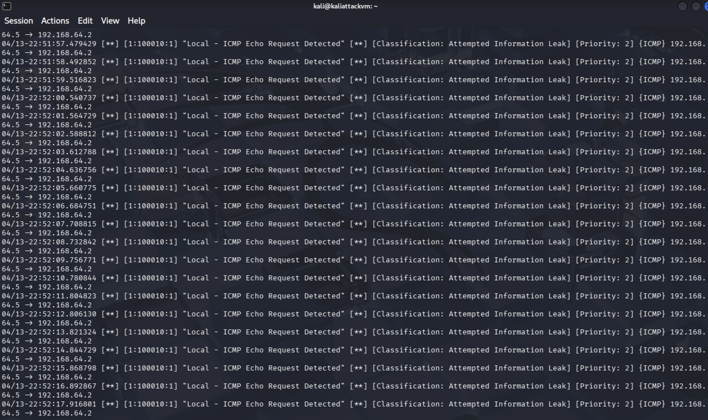

- Snort alerts for FIN, NULL, and Xmas scans.
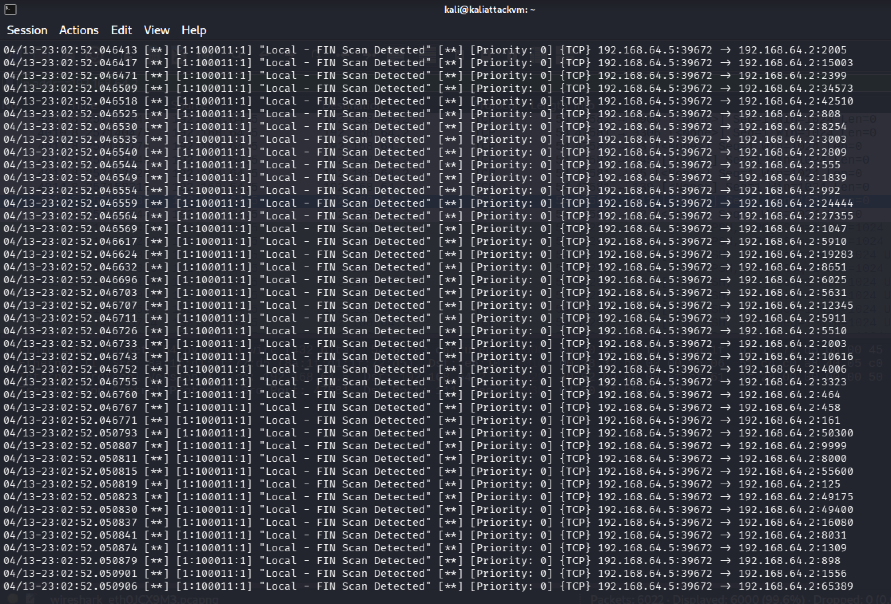
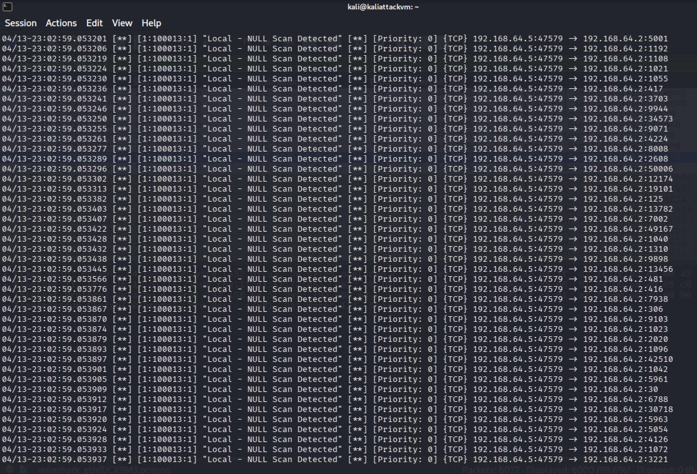
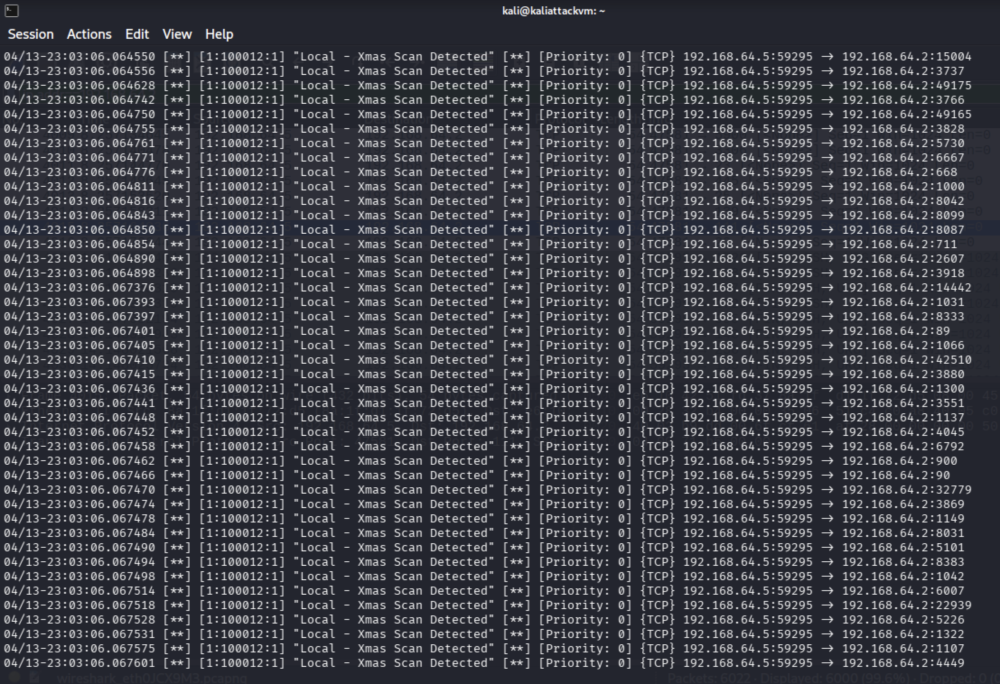

- Wireshark TCP flag views for one FIN, one NULL, and one Xmas packet.
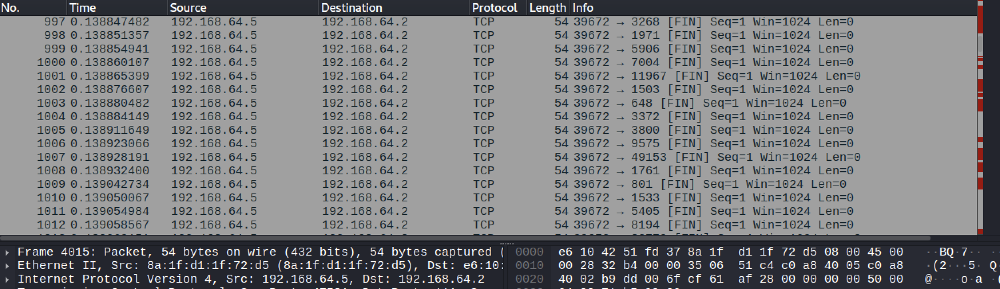
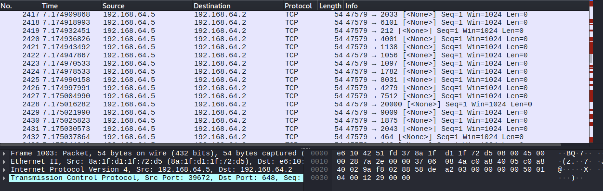
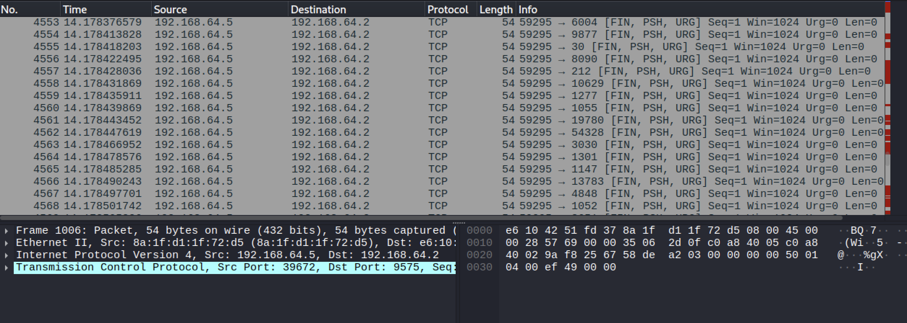

---

# **Task 3: FTP Login and Brute Force Detection (20 pts)**

---

## **Deliverables for Task 3**

### **Questions**:

### 1. What does the `"530 "` FTP response mean, and why is it used for brute force detection?

The FTP response code `"530 "` means **login authentication failed** or **login incorrect**. It is sent by the FTP server when a username or password is invalid.

This response is useful for brute force detection because repeated failed login responses from the server indicate that an attacker may be attempting multiple password guesses. By monitoring multiple `"530 "` responses within a short period, Snort can identify possible brute force login attempts.

---

### 2. Why is the `flow:from_server,established` keyword necessary for failed login detection?

The keyword `flow:from_server,established` ensures that Snort only inspects packets that are:

- **coming from the FTP server**
- part of an **already established TCP connection**

This is important because the `"530 "` message is generated by the server after a login attempt has already been made.

Without this flow keyword, Snort may inspect unrelated packets and create false positives.

---

### 3. Explain `detection_filter:track by_src, count 3, seconds 60;` and how it works.

This detection filter means that Snort tracks alerts **by source IP address**.

- `track by_src` → track the attacking source IP
- `count 3` → trigger after 3 matching events
- `seconds 60` → within 60 seconds

This means if the same attacker IP causes **3 failed login responses in 60 seconds**, Snort triggers the brute force alert.

This helps distinguish a single mistyped password from an actual attack.

---

### 4. How does `detection_filter` help reduce alert fatigue in Snort?

`detection_filter` reduces alert fatigue by preventing Snort from generating an alert for every single failed login attempt.

Instead of alerting on every packet, Snort waits until a suspicious threshold is reached.

This reduces excessive alert noise and helps security analysts focus on more meaningful threats such as repeated login failures that suggest brute force activity.

---

### 5. If this were a production deployment, how would you improve these rules?

In a production deployment, I would improve these rules by:

- lowering false positives with stricter thresholds
- tracking both source and destination behavior
- logging usernames being attempted
- adding alerts for successful logins after many failures
- correlating with IP reputation or geolocation
- integrating with firewall or IPS systems for automated blocking

I would also encourage replacing insecure FTP with secure alternatives such as **SFTP or FTPS** to protect credentials and data.

### **Screenshots**:
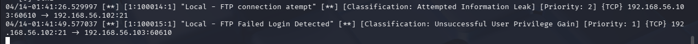
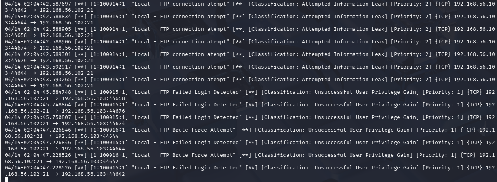

---

# **Task 4: Sensitive Data Exfiltration Detection via FTP (20 pts)**

---

## **Deliverables for Task 4**

### **Questions**:

### 1. Why is a regex (pcre) used in the Snort rule instead of simple content matching?

A regex (`pcre`) is used because it allows Snort to detect **patterns** rather than one exact fixed string.

For example, Social Security Numbers follow a common format:

XXX-XX-XXXX

Using a regex allows Snort to detect **any number sequence that matches this format**, such as `123-45-6789`, instead of only matching one specific SSN value.

This makes the rule more flexible and effective for detecting sensitive data leaks.

---

### 2. Why is FTP considered dangerous for transmitting sensitive data like SSNs?

FTP is dangerous because it sends data in **plain text**.

This means usernames, passwords, and file contents can be read by anyone who captures network traffic.

In this lab, Wireshark clearly showed:

`Employee SSN: 123-45-6789`

This demonstrates how an attacker monitoring the network could easily intercept sensitive personal information.

Because there is no encryption, FTP is considered insecure for transmitting confidential data.

---

### 3. How could an attacker exploit anonymous FTP servers in a real-world network?

An attacker could use anonymous FTP access to:

- download sensitive files
- upload malicious files
- exfiltrate confidential data
- scan directory structures
- collect internal company information

If sensitive documents are stored in the FTP directory and anonymous access is enabled, an attacker may retrieve them without authentication.

This can lead to data breaches, identity theft, and corporate espionage.

---

### 4. If traffic were using SSH, FTPS, or SFTP instead of FTP, how would detection change? Why?

Detection would become more difficult because SSH, FTPS, and SFTP use **encryption**.

Unlike FTP, the file contents would not be visible in plain text.

This means Snort would not be able to directly inspect the payload for patterns such as SSNs unless traffic is decrypted.

In these cases, detection would rely more on:

- metadata
- connection behavior
- file transfer volume
- unusual destinations
- endpoint monitoring

Encryption improves security but makes content-based IDS detection more challenging.
### **Screenshots**:
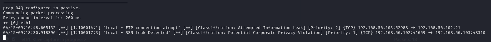
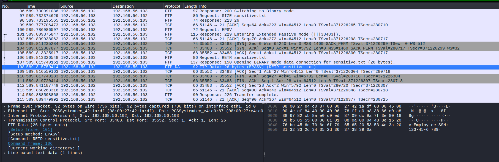

---

# **Task 5: SYN Flood Detection and Thresholding (20 pts)**

---

## **Deliverables for Task 5**

### **Questions**:
1. Why is `detection_filter` important for detecting SYN floods?
2. Why is `event_filter` important? What happens if we do not define this?
3. How would using `--rand-source` affect Snort’s detection?
4. Why can't Snort itself block SYN floods directly?
5. How could a firewall or IPS help defend against SYN floods?

### **Screenshots**:
- Snort alert showing SYN flood detection.
- Screenshot of `local.rules` containing the correct SYN flood rule.
- Screenshot of `snort.lua` showing the correct `event_filter`.

