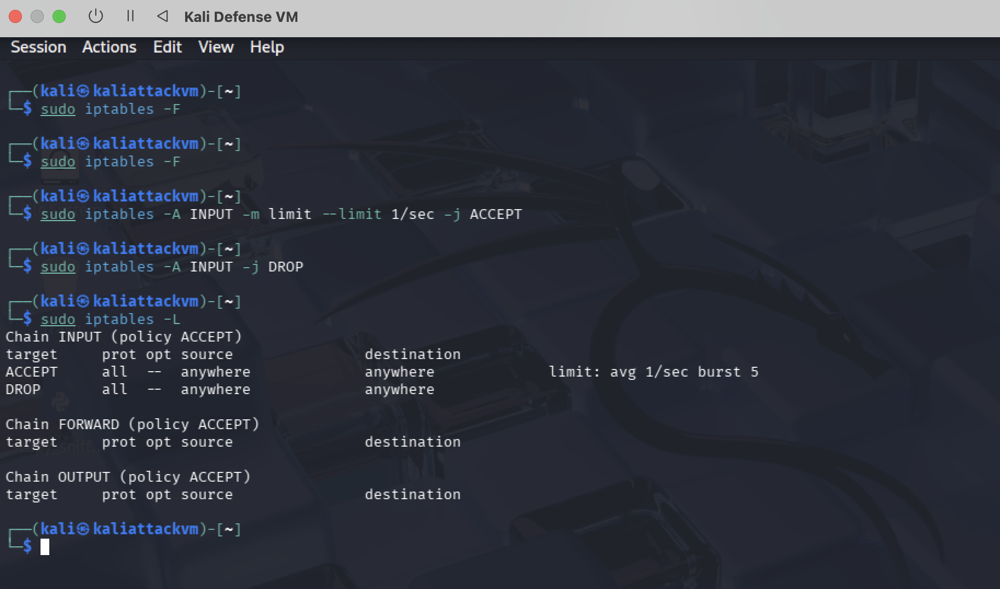
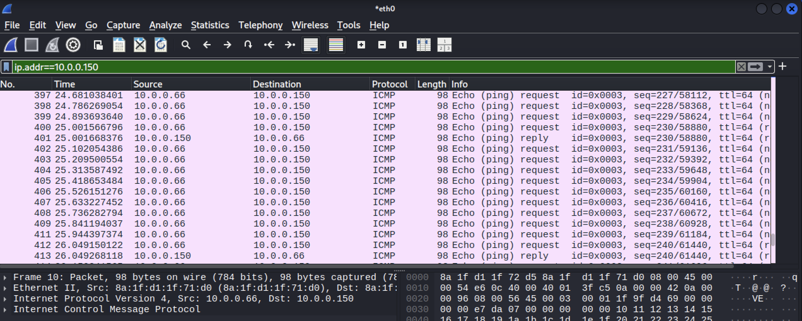
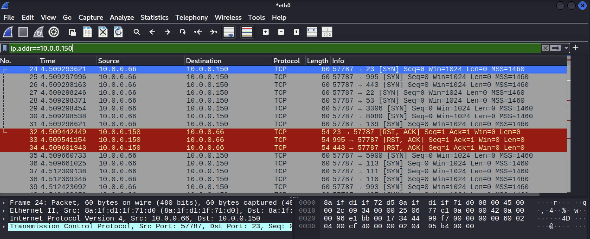
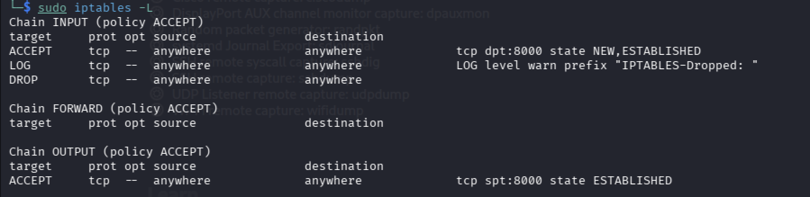
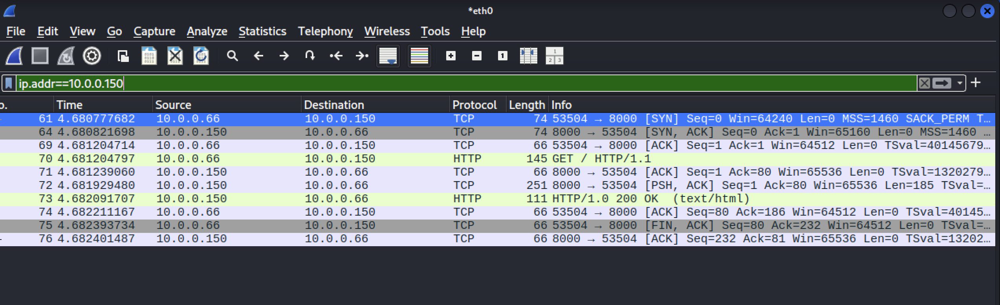
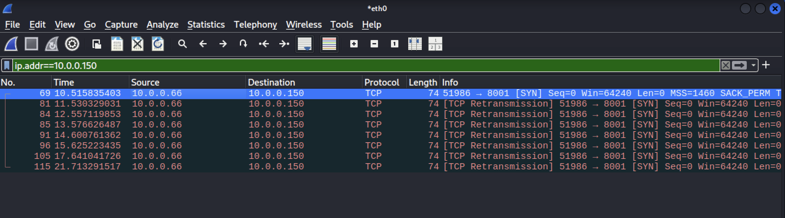
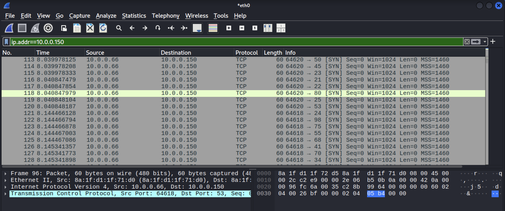
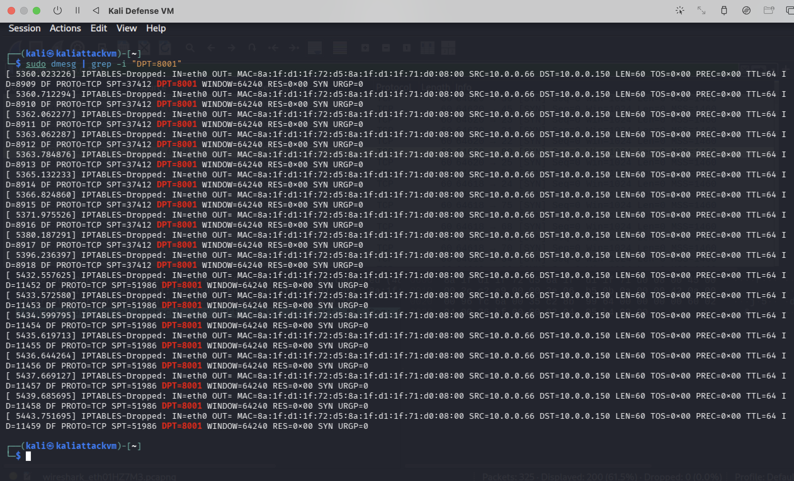

# **Lab 7 Report**  
##### CSCY 4742: Cybersecurity Programming and Analytics, Spring 2026

**Name & Student ID**: John Paul Bennett Jr., 110412273  

**Please select your course number:**  
- [ ] CSCY 4742 (Undergraduate)  

---
## **Task 1: IPTables Basics (10 pts)**

---

### **🔹 Step 1: Understanding IPTables Chains**

#### **Questions**: 
   1. In the output, note that IPTables has three built-in chains. Describe their purposes.
   2. **Explain the difference between these two actions**:
      - **DROP** vs. **REJECT**.
   3. Explain **when** each policy is typically used in a firewall configuration.

#### Screenshots

- **Provide screenshot of your `iptables -L` output.**
   
---

### **🔹 Step 2: Testing Network Traffic Before Applying Rules**

#### **Questions**:  
   - Analyze the captured traffic and describe your observations for a pair of PING requests and replies. Examine the ICMP data and explain the values of the **type** and **code** fields.

#### Screenshots
- **Provide screenshot of your Wireshark traffic capture.**

---

### **🔹 Step 3: Blocking Incoming Traffic on Defense VM**

#### **Questions**:
   - Do you observe any successful pings?  
   - What error message appears on the Attack VM, and why does it display **"Destination Port Unreachable"**?  
   - Analyze the captured traffic in Wireshark for a PING request and its corresponding reply. Describe any changes in packet behavior. Explain the changes observed in Defense VM's behavior toward PING requests.

#### Screenshots
- Provide screenshot of your `iptables` chains and your Wireshark traffic capture.

---
### **🔹 Step 4: Testing DROP vs. REJECT**

#### **Questions**:
   - How does the behavior differ between **DROP** and **REJECT**?
   - Why might a firewall administrator choose one over the other?

#### Screenshots
- Provide screenshot of your `iptables` chains and your Wireshark traffic capture.

---
## **Task 2: Defending Against ICMP & Web Reconnaissance (10 pts)**  

---

### **🔹 Step 1: Configuring ICMP Filtering**  

#### **Questions**:
   - Document your observations, focusing on ICMP traffic behavior in each scenario.  
   - How does filtering impact ICMP communication?  
   - Explain the importance of rule order and why more specific rules (e.g. accept icmp-request) should be defined before broader ones (e.g., drop all icmp).

#### Screenshots
- **Provide screenshot of your `iptables` chains and your Wireshark traffic capture for each scenario.**

---

### **🔹 Step 2: Reversing the Policy (Allowing Defense VM to Ping, Blocking Incoming Pings)**  

#### **Questions**:  
   - What differences do you observe compared to the previous test? How does the Defense VM’s new policy impact ICMP communication?  
   - Explain the practical significance of this policy in real-world scenarios.

#### Screenshots
- Provide screenshot of your `iptables` chains and your Wireshark traffic capture for each scenario.

---

### **🔹 Step 3: Turning Defense VM into a Web Server** and **Step 4: Securing HTTP Traffic with IPTables**  

#### **Questions**:
   - Explain how **iptables -m state --state NEW,ESTABLISHED** functions and why it is crucial for filtering TCP traffic.  
   - Why does the **input rule** for the allowed port (8000) specify **--state NEW,ESTABLISHED**, while the **output rule** only includes **--state ESTABLISHED**?  
   - Based on Wireshark observations, what key differences do you notice when attempting to access port **8000** versus **8001**?  
   - How does the firewall affect the **three-way handshake** for allowed connections compared to blocked ones?

#### Screenshots
- **Provide screenshot of your running webservers, `iptables` chains and your Wireshark traffic capture for both scenario, and also`nmap` scan.**

---
## **Task 3: Rate Limiting & Network Reconnaissance Defense (20 pts)**  

---
### **🔹 Step 1: Configuring Basic Rate Limiting**  

#### **Questions**:  
   - Explain your observations regarding packet loss and how the rate limit affects different types of traffic.  

When I pinged the virtual machine, I notice that there was a significant increase in the number of packets lost. At least 80% of the packets transmitted to the virtual machine had been lost. Rate limit tends to affect ICMP traffic significantly. Overall, rate limiting limits the number of requests sent to a machine, setting thresholds, and works differently with each type of traffic. For example, SYN traffic is limited when rate limiting is used due to the configuration targeting the TCP connections that are being made.

   - Does the rate limit completely block all ICMP pings? Why or why not?  

No. This is because it actually restricts how many can be processed within a given time period.

   - Calculate the theoretical and empirical rate of PING packet drops based on network traffic analysis.  

Theoretical rate: 0.99
Empirical rate: 0.83

   - Why is rate-limiting incoming traffic essential for network security and performance?

It caps the number of requests a user can make within a given timeframe. In doing so, it can protect against denial of service attacks and brute force login attempts. In terms of performance, it reduces server overload and ensures fair resource utilization.
 
   - What potential challenges or drawbacks could arise when implementing rate-limiting in a real-world network environment? How can these be mitigated?  

Potential challenges such as misconfigured limits, false positives, managing bursty traffic and handling complex distributed environments are challenges that can arise when implementing rate-limiting in a real-world network environment. They can be mitigated by implementing soft limits before hard caps, utilizing the token bucket algorithm to allow for burstiness while averaging throughput, utilizing a centralized, fast data store, authenticated API keys/tokens, and rate limiting at the edge to stop network traffic early in order to prevent bottlenecks.

#### Screenshots
- Provide screenshot of your `iptables` chains and your Wireshark traffic capture.

---
### **🔹 Step 2: Testing with Nmap - Aggressive Scan (-T5)**  

#### **Questions:**  
   - Does the scan complete successfully? If so, is the result accurate (does it correctly detect port **8000** as open)?  

Yes, the scan does complete successfully. It correctly detects port **8000** as open.

   - Based on observations, how does the **scan rate** affect the accuracy and detection of open ports?  

Excessively high scan rates can reduce detection accuracy. This overloads networks, causing dropped packets which carry information on the open ports that the machine doing the scanning has missed. Scan rate dictates the balance between speed and accuracy in port scanning.
  
   - Referencing the [Nmap Performance Guide](https://nmap.org/book/performance-timing-templates.html), how do timing templates influence scan behavior and detection efficiency?

Timing templates allow users to balance scan speed with accuracy and IDS(Intrusion Detection System) evasion. The templates adjust packet delays and parallelism. Lower settings offer stealth at the expense of speed. Higher settings prioritize rapid, aggressive scanning over reliability.

   - Which **Nmap timing profile(s)** (`-T0` to `-T4`) could potentially bypass this rate-limiting rule? Justify your answer based on scan behavior and rate thresholds. What is the main drawback of choosing this/these profile(s)?

NMAP timing profile -T0, which is the paranoid setting, could potentially bypass the rate-limiting rule. It is the slowest template, designed for evasion of detection. It waits five minutes before performing the next scan. The main drawback of choosing this timing profile is that it is extremely slow.

#### Screenshots
- Provide screenshot of your `iptables` chains and your Wireshark traffic capture.

---
## **Task 4: Logging and Monitoring Firewall Activity (20 pts)**  

---

### **🔹 Step 1: Configuring Firewall Rules to Allow Only HTTP Traffic (Port 8000)**
  
#### Screenshots
- Provide screenshot of your `iptables` chains and your Wireshark traffic capture for all three scenarios (website visits and `nmap`).

**Port 8000 Wireshark Traffic Capture**

**Port 8001 Wireshark Traffic Capture**

**NMAP Wireshark Traffic Capture**

---

### **🔹 Step 2: Viewing and Analyzing Firewall Logs**  

#### **Questions:**  
   - What source IP addresses are attempting to connect?

10.0.0.66

   - What ports are being targeted?

Ports 8000 and 8001.

   - Modify the log search command to filter packets related to **port 8001**. How many entries are recorded in the logs?  

18 entries were recorded in the logs.
 
   - How does logging contribute to identifying and mitigating suspicious activity?

It uses real time alerting, allows for incident investigation and improves troubleshooting. All this helps strengthen the security of digital assets and computer systems.

#### Screenshots
- Provide screenshots of your `dmesg` output for port `8001`

---

## **Task 5: Filtering and Logging Network Attacks (40 pts)**  
---

### **🔹 Step 1: Configuring Rate-Limiting and Logging on Defense VM**  

#### **Questions:**  
   - How many ICMP packets were logged as **exceeding the rate limit**?  
   - How did the Defense VM handle the attack?  
   - How would attackers try to bypass this defense?  

#### Screenshots
- Provide screenshot of your `iptables` chains, your `dmesg` logs, your ping results on Attack VM and your Wireshark traffic capture.

---
### **🔹 Step 2: Detecting and Logging Regular Nmap Scans**  

#### **Questions:**  
   - How many scan attempts were logged as exceeding the threshold?
   - Was the scan able to identify any open ports, or was it blocked?  
   - How does rate-limiting SYN packets help prevent port scanning?  
   - What modifications could an attacker use to bypass this detection mechanism?  

#### Screenshots
- Provide screenshot of your `iptables` chains, your `dmesg` logs, your `nmap` results on Attack VM and your Wireshark traffic capture.

---

### **🔹 Step 3: Testing Slow and Stealthy Nmap Scans**  

#### **Questions:**  
   - How does the detection of a slow scan compare to a rapid scan?  
   - Was the slow scan still able to identify open ports?  
   - What modifications could an attacker use to further evade detection?  
   - How can defensive rules be improved to account for stealthier attacks?  

#### Screenshots
- Provide screenshot of your `iptables` chains, your `dmesg` logs, your `nmap` results on Attack VM.

---

### **🔹 Step 4: Detecting, Logging, and Filtering SSH Brute-Force Attacks**  

#### **Questions**  

   - How many SSH connection attempts were logged before the attacker was blocked?  
   - Did the Defense VM successfully block further attempts after the threshold was exceeded?  
   - How might attackers attempt to bypass this defense mechanism?  
   - What additional measures can enhance SSH security beyond rate-limiting?  

#### Screenshots
- Provide screenshot of your `iptables` chains, legitimate SSH output on Attack VM, your `dmesg` logs, your `nmap` SSH brute-force output on Attack VM.

---

### **🔹 Step 5: Detecting, Logging, and Filtering SYN Flood Attacks**  

**Questions**  

   - How many SYN packets were logged before the Defense VM blocked further requests?  
   - Did the Defense VM successfully mitigate the SYN flood attack while allowing normal connections?
   - Why with ``--rand-source``, the detection fails? Explain.  
   - What alternative techniques could attackers use to evade this SYN flood protection?  
   - What additional measures can be taken to improve SYN flood mitigation?  

#### Screenshots
- Provide screenshot of your `iptables` chains, legitimate TCP connection and SYN flooding outputs with and without spoofing on Attack VM, and your `dmesg` logs.

---

### **🔹 Step 6: Detecting, Logging, and Filtering High-Rate HTTP Attacks**  
 

#### **Questions**  

   - How many HTTP requests were logged before the Defense VM blocked further requests?  
   - Did the Defense VM successfully mitigate the HTTP flood while allowing normal web traffic?  
   - What alternative techniques could attackers use to evade this HTTP flood detection?  
   - What additional measures can be taken to improve web server protection against HTTP-based DoS attacks?  

#### Screenshots
  - Provide screenshot of your `iptables` chains, legitimate HTTP output and HTTP flood output on Attack VM, and your `dmesg` logs.

