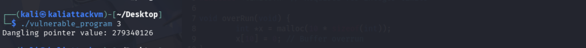
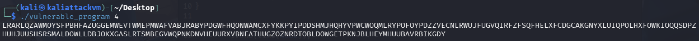
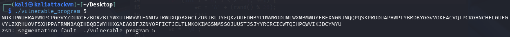
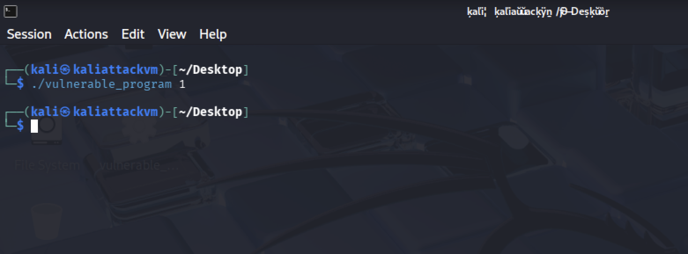
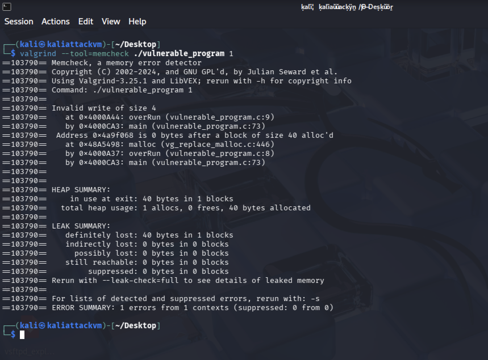
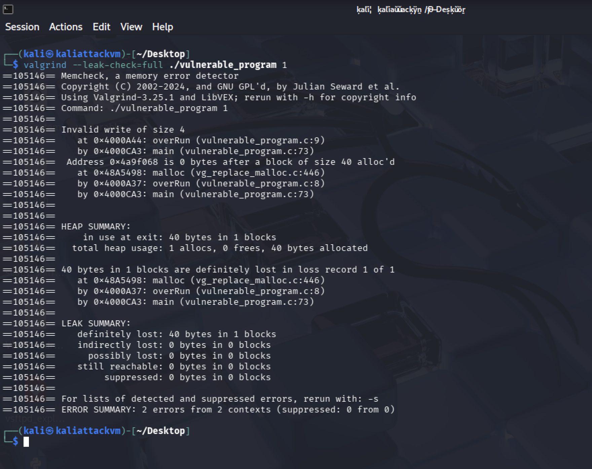
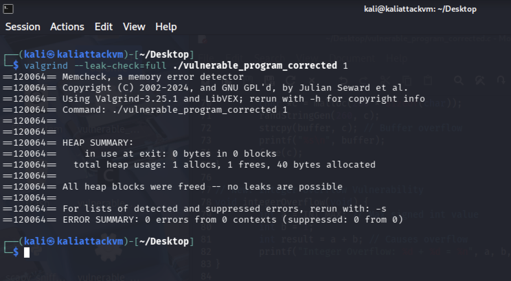

# **Lab 6 Report**  
##### CSCY/CSCI 4742: Cybersecurity Programming and Analytics, Spring 2026

**Name & Student ID**: John Paul Bennett Jr., 110412273  

---

## **Task 1: Implement & Analyze Additional Vulnerabilities**  

1. **Commented Source Code**  
	
2. **Program Outputs**
     
     
     

---

## **Task 2: Out-of-Bounds Write (Valgrind)**
### **Screenshots**  
1. *(Screenshot of running `./vulnerable_program 1` without Valgrind.)*
 
3. *(Screenshot of Valgrind output: `valgrind --tool=memcheck ./vulnerable_program 1`.)*
 
5. *(Screenshot of Valgrind with `--leak-check=full`.)*
 
7. *(Screenshot after fixing the `overRun` function to confirm no more errors.)*
 

### **Answers to Questions**  
- **1.** Why does this invalid write error happen?  
  *(Answer here)*  
- **2.** Why does Valgrind report an "invalid write of size 4"? What does `4` represent?  
  *(Answer here)*  
- **3.** What is an off-by-one error? Do you see this error in the `overRun` function?  
  *(Answer here)*  
- **4.** What is a memory leak? Explain in your own words. Do you see a memory leak in the `overRun` function?  
  *(Answer here)*  
- **5.** Can errors like this occur in Java? Why or why not?  
  *(Answer here)*  
- **6.** Compare the Heap Summary from normal Valgrind output vs. `--leak-check=full`. What additional details are shown?  
  *(Answer here)*  

### **Updated Code for `overRun` Function**  
```c
/* Insert your corrected overRun function here. 
   Include inline comments explaining the fix. */
```

---

## **Task 3: Uninitialized Pointer Analysis**  
### **Screenshots**  
1. *(Screenshot of `valgrind --tool=memcheck --leak-check=full ./vulnerable_program 2`.)*  
2. *(Screenshot with `--track-origins=yes` for more detail.)*  
3. *(Screenshot of fixed function showing no more uninitialized pointer usage issues.)*  

### **Answers to Questions**  
- **7.** Where is the memory problem occurring? What does Valgrind report?  
  *(Answer here)*  
- **8.** What is an uninitialized pointer? How could it be exploited?  
  *(Answer here)*  
- **9.** What is the difference between a `NULL` pointer and an uninitialized pointer?  
  *(Answer here)*  
- **10.** What specifically in the code do you believe caused the uninitialized pointer usage?  
  *(Answer here)*  
- **11.** What additional detail does `--track-origins=yes` provide?  
  *(Answer here)*  
- **12.** "Use of uninitialized value of size 8" — what does the `8` refer to?  
  *(Answer here)*  

### **Updated Code for `unInitializedPtr` Function**  
```c
/* Insert your corrected unInitializedPtr function here. 
   Include inline comments explaining the fix. */
```

---

## **Task 4: Dangling Pointer Analysis**  
### **Screenshots**  
1. *(Screenshot of `./vulnerable_program 3` without Valgrind — note behavior.)*  
2. *(Screenshot of Valgrind output: `valgrind --tool=memcheck --leak-check=full --track-origins=yes ./vulnerable_program 3`.)*  
3. *(Screenshot after fixing `danglingPtr`, showing no error.)*  

### **Answers to Questions**  
- **13.** What is the potential issue in the `danglingPtr` function?  
  *(Answer here)*  
- **14.** How could a dangling pointer be exploited?  
  *(Answer here)*  
- **15.** What does Valgrind report about the freed memory usage?  
  *(Answer here)*  
- **16.** Why does Valgrind possibly show no final "heap error" even though it’s a dangerous bug?  
  *(Answer here)*  

### **Updated Code for `danglingPtr` Function**  
```c
/* Insert your corrected danglingPtr function here. 
   Include inline comments explaining the fix. */
```

---

## **Task 5: Buffer Overflows Analysis**  
### **Screenshots**  
- **For `bufferUnder` (Input 4):**  
  1. *(Screenshot of Valgrind output with `./vulnerable_program 4`.)*  
- **For `bufferOver` (Input 5):**  
  2. *(Screenshot of Valgrind output with `./vulnerable_program 5` — if any overflow detected.)*  
  3. *(Screenshot of AddressSanitizer detection using `./vulnerable_program2 5`.)*  
  4. *(Screenshot after fixing `bufferOver`, no errors remain.)*  

### **Answers to Questions**  
- **(Regarding `bufferUnder`, Input 4)**  
  - **15.** Do you see errors in the Valgrind output?  
    *(Answer here)*  
  - **16.** After reading the code, do you expect errors? Why/why not?  
    *(Answer here)*  

- **(Regarding `bufferOver`, Input 5)**  
  - **17.** Do you expect an error here? Why?  
    *(Answer here)*  
  - **18.** Does Valgrind detect it? If so, what is reported?  
    *(Answer here)*  
  - **19.** Why does Valgrind sometimes struggle to detect this kind of buffer overflow?  
    *(Answer here)*  

- **(Valgrind vs. Other Tools)**  
  - **20.** List two additional Valgrind tools besides `memcheck`.  
    *(Answer here)*  
  - **21.** How could these other tools detect errors that `memcheck` misses?  
    *(Answer here)*  

### **AddressSanitizer Findings**  
- **22.** What errors does AddressSanitizer report for input `5`?  
  *(Answer here)*  
- **23.** Where in the code does it say the error occurs?  
  *(Answer here)*  
- **24.** How does AddressSanitizer compare to Valgrind in detecting buffer overflows?  
  *(Answer here)*  

### **Updated Code for `bufferOver` Function**  
```c
/* Insert your corrected bufferOver function here. 
   Include inline comments explaining the fix. */
```

---

## **Task 6: Integer Overflow Analysis**  
### **Screenshots**  
1. *(Screenshot of `./vulnerable_program 6` showing normal run — note any incorrect result.)*  
2. *(Screenshot of `valgrind --tool=memcheck ... ./vulnerable_program 6` showing whether it detects overflow.)*  
3. *(Screenshot of UBSan detection: `./vulnerable_program2 6`.)*  
4. *(Screenshot of fixed function, showing no more overflow vulnerability.)*  

### **Answers to Questions**  
- **25.** Why does the overflow occur at `UINT_MAX + 1`?  
  *(Answer here)*  
- **26.** What are common security risks of integer overflows, and how might attackers exploit them?  
  *(Answer here)* 
 - **27.** Does Valgrind report the integer overflow? If not, why?  
 *(Answer here)* 
- **28.** Does UBSan report an error?  
  *(Answer here)*  
- **29.** Where in the code does UBSan say the overflow occurs?  
  *(Answer here)*  
- **30.** Compare UBSan’s detection to Valgrind’s.  
  *(Answer here)*  

### **Updated Code for `integerOverflow` Function**  
```c
/* Insert your corrected integerOverflow function here. 
   Include inline comments explaining the fix. */
```

---

## **Task 7: Static Analysis with Flawfinder**  
### **Screenshots**  
1. *(Screenshot of `flawfinder vulnerable_program.c` output.)*  

### **Answers to Questions**  
- **31.** Differentiate static vs. dynamic analysis of source code.  
  *(Answer here)*  
- **32.** How do static analysis tools like Flawfinder differ from dynamic tools (Valgrind, AddressSanitizer)?  
  *(Answer here)*  

### **Flawfinder Vulnerabilities**  
- **33.** `strcpy` issues  
  - Location, risk level, CWE classification, and prevention.  
  *(Answers here)*  
- **34.** `srand` usage (weak randomness)  
  - Why is it a concern, relevant CWE, safer alternatives.  
  *(Answers here)*  
- **35.** Statically-sized arrays  
  - Where used, security risks, relevant CWE, safer approaches.  
  *(Answers here)*  

*(Paste or summarize key parts of the Flawfinder output. Explain any false positives or unaddressed concerns.)*

---


# **Lab 6: Summary & Reflections**  

### **Key Takeaways from Lab 6**  
*(Summarize your main findings, what you learned, and any challenges faced during the lab.)*  
