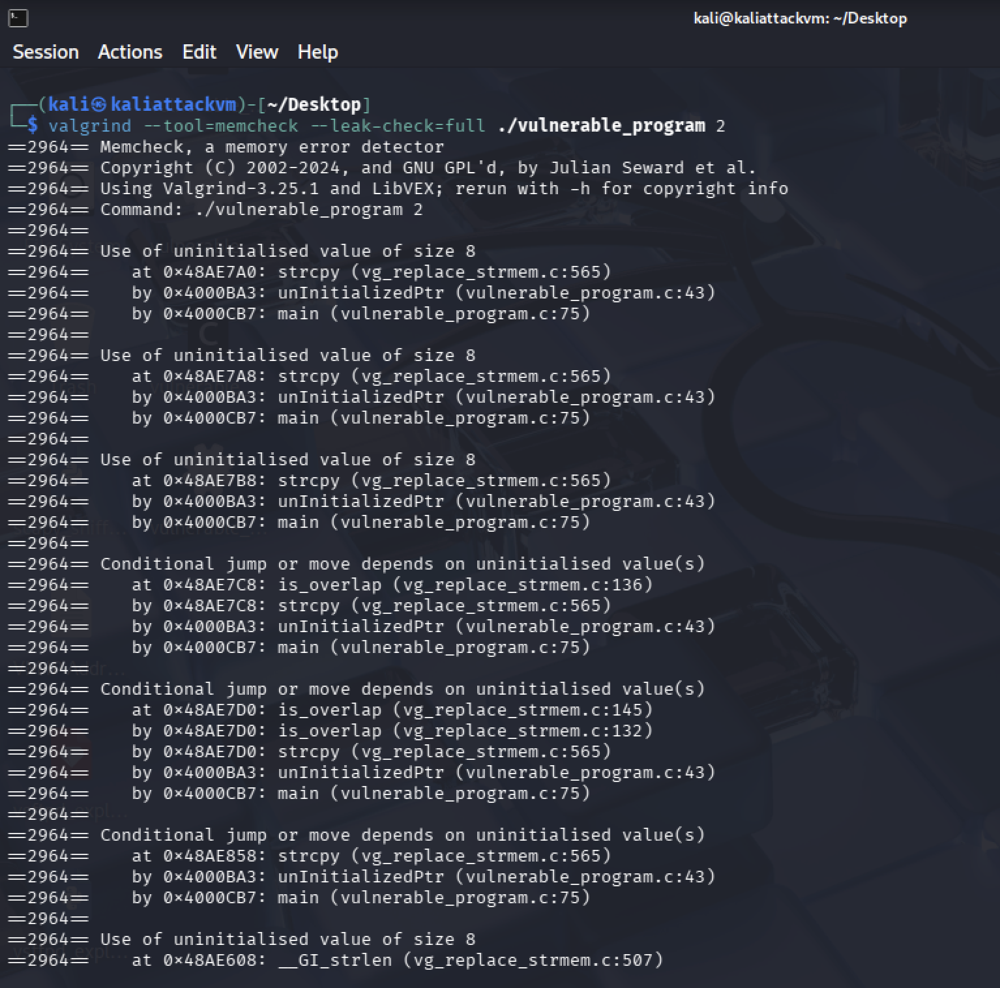
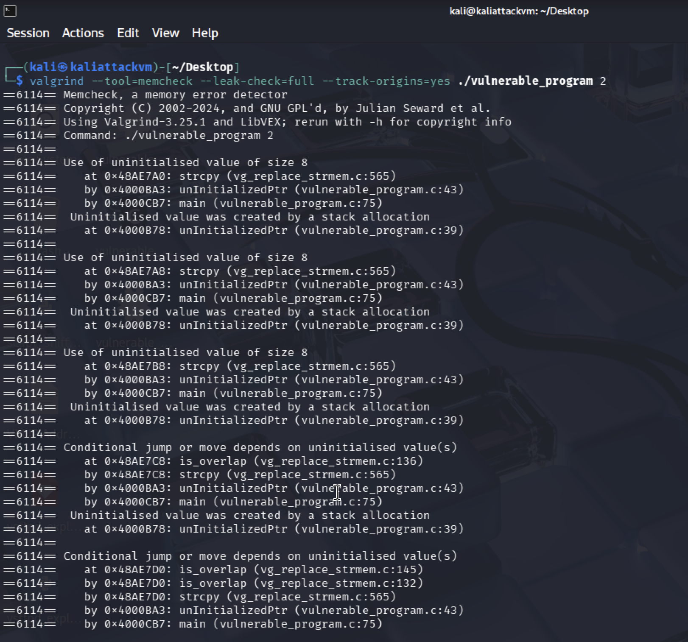
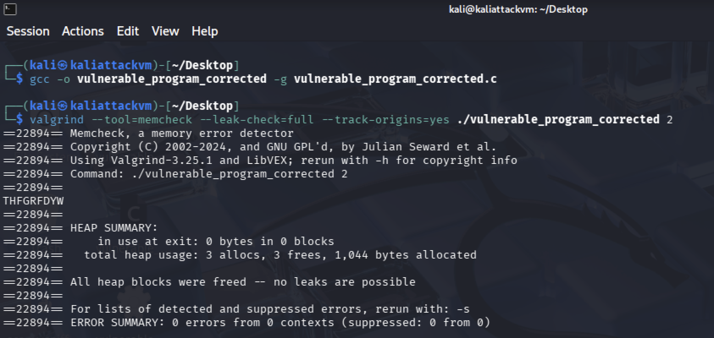
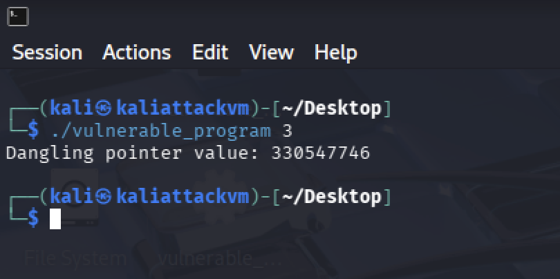
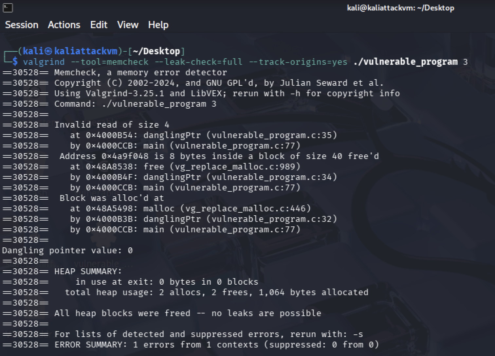
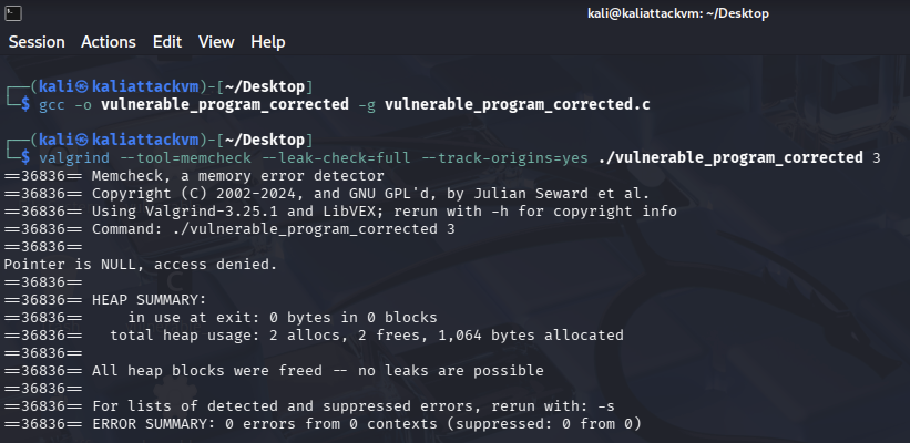

# **Lab 6 Report**  
##### CSCY/CSCI 4742: Cybersecurity Programming and Analytics, Spring 2026

**Name & Student ID**: John Paul Bennett Jr., 110412273  
**Name & Student ID**: Earnest Kyle, 109969905
**Name & Student ID**: Shriram Rajagopal
**Name & Student ID**: Zachary Lawlor
---

## **Task 1: Implement & Analyze Additional Vulnerabilities**  

1. **Commented Source Code**  
	
2. **Program Outputs**
     
     
     

---

## **Task 2: Out-of-Bounds Write (Valgrind)**
### **Screenshots**  
 
 
 
 

### **Answers to Questions**  
- **1.** Why does this invalid write error happen?  
The error happens when a program attempts to write data to a memory location outside the boundaries of its allocated buffer or array.

- **2.** Why does Valgrind report an "invalid write of size 4"? What does `4` represent?  
Valgrind reports "invalid write of size 4" to indicate that the program attempted to write four bytes of data to a memory location it is not allowed to access, the number of bytes written being represented by the four.

- **3.** What is an off-by-one error? Do you see this error in the `overRun` function?
An off-by-one-error is a logic error that occurs commonly and is where a loop or algorithm iterates one time too many or one time too few. I do not see the error in the 'overRun' function.
- **4.** What is a memory leak? Explain in your own words. Do you see a memory leak in the `overRun` function?  
A memory leak is an error within a computer program when it fails to release allocated but unnecessary memory. This causes issues such as makin the computer program use more amounts of RAM in the computer system as time passes. I do see a memory leak in the overRun function as 40 bytes of data were lost according to the Valgrind leak summary. 
- **5.** Can errors like this occur in Java? Why or why not?  
Errors like that can still occur in Java. Even though the Java programming language has a built in garbage collector which manages memory, objects that are unneeded but still referenced due to programming mistakes can still leak.
- **6.** Compare the Heap Summary from normal Valgrind output vs. `--leak-check=full`. What additional details are shown?  
Information that indicates how many bytes of allocated data were lost, and information showing the numbers which indicate lines of code where programming errors began as functions were called.

### **Updated Code for `overRun` Function**  
```c
// Function for triggering buffer overrun
void safeRun(void) {
	int *x = malloc(10 * sizeof(int));
	if (x == NULL) {
		// Handle allocation failure
		return;
	}
```

---

## **Task 3: Uninitialized Pointer Analysis**  
### **Screenshots**  
 
   
 

### **Answers to Questions**  
- **7.** Where is the memory problem occurring? What does Valgrind report?  
The memory problem occurs on lines 39 and 43 in the program according to the Valgrind report. Valgrind reports that there is an issue with the strcpy function usage. Valgrind also reports that an unitialised value was created by a stack allocation.
- **8.** What is an uninitialized pointer? How could it be exploited?  
An uninitialized pointer is a variable declared as a pointer but not assigned a valid memory address. It can be exploited to cause system crashes, unauthorized memory reads/information leaks, and even arbitrary code execution by writing to unintended memory locations.
- **9.** What is the difference between a `NULL` pointer and an uninitialized pointer?  
A null pointer is explicitly assigned a specific known value: "NULL"/"nullptr", which indicates that it does not point to any valid memory location. An uninitialized pointer, however, contains an arbitrary and unknown garbage value that is left over in memory.
- **10.** What specifically in the code do you believe caused the uninitialized pointer usage?  
According to the Valgrind report, line 39 was responsible for the uninitialized pointer usage. The free() code had been used at the wrong time, and as a result, unnecessary memory was referenced, thus leading to the uninitialized pointer usage. In short, it had been caused by a dangling pointer.
- **11.** What additional detail does `--track-origins=yes` provide?  
It shows the origin of the programming error. In this case, the programming error's source was a stack allocation caused by line 39 in the vulnerable program's code.
- **12.** "Use of uninitialized value of size 8" — what does the `8` refer to?  
8 refers to the size, in bytes, of the uninitialized data type the program is using.

### **Updated Code for `unInitializedPtr` Function**  
```c
// Function for triggering uninitialized pointer usage
void InitializedPtr(void) {
	// Initialize 'buffer' pointer
	char *buffer = malloc(10 * sizeof(char)); // Allocate memory for buffer
	if (buffer == NULL) {
	printf("Memory allocation failed for buffer!\n");
	return; // Exit if there is a memory allocation failure
	}
	
	// Properly allocate memory for 'c' variable
	char *c = malloc(10 * sizeof(char));
	if (c == NULL) {
		printf("Memory allocation failed for c!\n");
		free(buffer); // Free any memory allocated previously.
		return;
	}
```

---

## **Task 4: Dangling Pointer Analysis**  
### **Screenshots**  
 
 
 

### **Answers to Questions**  
- **13.** What is the potential issue in the `danglingPtr` function?  
The potential issue is the placement of the "free()" function within the 'danglingPtr' function. Freeing memory at the wrong time can lead to a dangling pointer.
- **14.** How could a dangling pointer be exploited?  
It can be exploited to achieve serious security compromises, especially arbitrary code execution, denial of service attacks, and information leakage.
- **15.** What does Valgrind report about the freed memory usage?  
It reports that there were 2 frees in total heap usage. There were also 2 allocations and a total of 1,064 bytes had been allocated.
- **16.** Why does Valgrind possibly show no final "heap error" even though it’s a dangerous bug?  
It may report no heap errors because it only detects issues during actual execution of flawed code paths. Valgrind only monitors memory access.

### **Updated Code for `danglingPtr` Function**  
```c
// Function for triggering dangling pointer access
void PtrSafeguard(void) {
	int *x;
	int *y = malloc(10 * sizeof(int));
	
	if (y == NULL) {
		printf("Memory allocation failed!\n");
		return; // Exit if there is a memory allocation failure
	}
	
	x = y;
	
	// Perform operations on variables x or y
	
	free(y); // Free memory
	y = NULL; // Set variable to NULL to avoid accidental use
	
	x = NULL; // Set variable to NULL to avoid accidental use
	
	// Safely access x or y given that they are NULL
	if (x != NULL) {
		int t = x[2]; // Safe, won't be executed
		printf("Dangling pointer value: %d\n", t);
	} else {
		printf("Pointer is NULL, access denied.\n");
	}
}
```

---

## **Task 5: Buffer Overflows Analysis**  
### **Screenshots**  


### **Answers to Questions**  
**(Regarding `bufferUnder`, Input 4)**  
**15.** Do you see errors in the Valgrind output?

No. The Valgrind output shows:

- `All heap blocks were freed -- no leaks are possible`
- `ERROR SUMMARY: 0 errors from 0 contexts`

This means Valgrind did **not** detect any memory errors or memory leaks when running the program with input `4`.

**16.** After reading the code, do you expect errors? Why/why not?  

No, I would not expect to see any errors.

The `bufferUnder` function copies a randomly generated string into a **256-byte buffer**, and this case is labeled **"No Buffer Overflow Expected."** Based on that, the string being copied should fit inside the destination buffer without exceeding its size.

Since the copied data stays within the bounds of the buffer, there should be:

- no buffer overflow,
- no invalid memory writes,
- and no memory leak if allocated memory is freed correctly.

The Valgrind results confirm this expectation because it reported **0 errors**.  

**(Regarding `bufferOver`, Input 5)**  
**17.** Do you expect an error here? Why? 

Yes, I would expect there to be an error in the code.

The `bufferOver` function creates a **260-character string** and then copies it into a **256-byte buffer**. Since the source string is larger than the destination buffer, this can write past the end of the buffer and cause a **buffer overflow**.

This is unsafe because writing beyond the buffer boundaries can corrupt nearby memory and lead to undefined behavior.

**18.** Does Valgrind detect it? If so, what is reported?  

No, based on the output shown, Valgrind does **not** detect the buffer overflow in this run.

The output reports:

- `All heap blocks were freed -- no leaks are possible`
- `ERROR SUMMARY: 0 errors from 0 contexts`

So even though the code contains a real buffer overflow, Valgrind did not report any errors here.
 
**19.** Why does Valgrind sometimes struggle to detect this kind of buffer overflow?  

Valgrind can miss some buffer overflows because it is better at detecting **invalid heap memory access** than certain **stack-based overflows**.

In this case, the overflow happens when data is copied into a local stack buffer. If the write stays within memory that Valgrind still considers addressable for the stack frame, it may not flag it as an invalid access.

So Valgrind may fail to detect this kind of bug because:

- the overflow happens on the **stack**, not necessarily in heap memory,
- the overwritten bytes may still fall inside memory Valgrind sees as accessible,
- and the program may not immediately crash even though memory corruption occurred.

That is why tools like **AddressSanitizer** are often better for detecting stack buffer overflows. 

- **(Valgrind vs. Other Tools)**  
**20.** List two additional Valgrind tools besides `memcheck`. 

Two other Valgrind tools are:

- **Massif** – a heap memory profiler
- **Helgrind** – a multithreaded race condition detector

Other valid tools include:

- **DRD** – detects thread synchronization issues and data races
- **Callgrind** – analyzes function calls and performance
- **Cachegrind** – analyzes cache usage and CPU performance
   
**21.** How could these other tools detect errors that `memcheck` misses?  

- **Massif**
  Helps analyze how much heap memory the program uses over time.
  This can help identify excessive memory usage, memory growth, or hidden leaks that may not be obvious during normal `memcheck` runs.

- **Helgrind**
  Detects issues in multithreaded programs such as:
  - race conditions
  - improper locking
  - deadlocks
  - thread synchronization problems

  These are errors that `memcheck` does not focus on.

For example, while `memcheck` is great for detecting invalid reads/writes and leaks, **Helgrind can catch bugs caused by two threads modifying the same variable at the same time**.

This makes Valgrind useful beyond just memory leak detection.  

### **AddressSanitizer Findings**  
**22.** What errors does AddressSanitizer report for input `5`?  

AddressSanitizer reports a **stack-buffer-overflow** error.

The output shows that a **write of size 260** occurred, which means the program attempted to copy more data into the buffer than the buffer could hold. 

**23.** Where in the code does it say the error occurs?  

The error occurs in the `bufferOver` function at:

- **`vulnerable_program.c:154`**

AddressSanitizer also shows that the affected variable is:

- **`buffer`** declared around **line 145**

This indicates that the overflow happened when writing past the bounds of the local stack buffer.

**24.** How does AddressSanitizer compare to Valgrind in detecting buffer overflows? 

AddressSanitizer detects the buffer overflow much more clearly than Valgrind in this case.

- **Valgrind** reported:
  - `ERROR SUMMARY: 0 errors from 0 contexts`

- **AddressSanitizer** reported:
  - `stack-buffer-overflow`
  - the exact function: `bufferOver`
  - the exact line number: **154**
  - the affected variable: `buffer`
  - details showing that memory access overflowed the stack buffer

So, AddressSanitizer is better for detecting this type of **stack-based buffer overflow**, while Valgrind may miss it.  

### **Updated Code for `bufferOver` Function**  
```c
// Vulnerability 5: Heap-to-stack buffer overflow
void bufferOver(void)
{
    char buffer[256]; // Fixed-size destination buffer

    char *c = malloc(256 * sizeof(char));
    // FIX: Allocate only 256 bytes so source matches destination size

    randStringGen(255, c);
    // FIX: Generate at most 255 characters, leaving room for '\0'

    strncpy(buffer, c, sizeof(buffer) - 1);
    // FIX: Copy only up to 255 characters to prevent overflow

    buffer[sizeof(buffer) - 1] = '\0';
    // FIX: Ensure null termination in case strncpy doesn't add it

    printf("%s\n", buffer);

    free(c);
    // FIX: Free allocated memory to prevent memory leak
}
```

---

## **Task 6: Integer Overflow Analysis**  
### **Screenshots**  
 
  
 
  

### **Answers to Questions**  
**25.** Why does the overflow occur at `UINT_MAX + 1`?

This issue occurs because the function uses a signed 32-bit integer that is already at its maximum possible value, `INT_MAX`, which is `2147483647`.

When `1` is added to `INT_MAX`, the result exceeds the largest value that a signed 32-bit integer can store. Because the value cannot be represented correctly, an integer overflow occurs, and the result wraps around to `-2147483648`.
 
**26.** What are common security risks of integer overflows, and how might attackers exploit them?  

Integer overflows are dangerous because they can cause unexpected program behavior and lead to serious security vulnerabilities.

Some risks include:

- incorrect calculations
- negative values appearing where only positive values are expected
- incorrect memory allocation sizes
- buffer overflows
- crashes
- undefined behavior

Attackers can exploit integer overflows by providing very large input values that force arithmetic operations past the allowed range.

For example, if an overflow happens when calculating the size of memory to allocate, the program may allocate too little memory. If the program then writes more data than that memory can hold, it can cause a buffer overflow. This can lead to memory corruption, denial of service, or even arbitrary code execution.

**27.** Does Valgrind report the integer overflow? If not, why?  

No, Valgrind does **not** report the integer overflow.

The Valgrind output shows:

- `ERROR SUMMARY: 0 errors from 0 contexts`

This means Valgrind did not detect any errors during execution.

The reason is that **Valgrind Memcheck is designed primarily to detect memory-related issues**, such as:

- memory leaks
- invalid reads and writes
- use of uninitialized memory
- invalid free operations

However, **integer overflow is an arithmetic/undefined behavior issue**, not a direct memory access issue.

Since the overflow occurs during a mathematical operation (`INT_MAX + 1`) and does not immediately involve invalid memory access, Valgrind does not flag it.

Tools like **Undefined Behavior Sanitizer (UBSan)** or **AddressSanitizer with undefined checks enabled** are better suited for detecting integer overflow vulnerabilities.

**28.** Does UBSan report an error?  

Based on the output shown, UBSan does **not** display a visible runtime error message in this run.

The program only prints:

`Integer Overflow: 2147483647 + 1 = -2147483648`

So, from the terminal output provided, there is **no UBSan warning shown on screen**. 

**29.** Where in the code does UBSan say the overflow occurs?  

The overflow occurs in the `integerOverflow` function on **line 174**:

`int result = a + b;`

That is the line where `1` is added to `INT_MAX`, causing the integer overflow.

**30.** Compare UBSan’s detection to Valgrind’s.

Valgrind did **not** detect the integer overflow and reported:

`ERROR SUMMARY: 0 errors from 0 contexts`

UBSan is the more appropriate tool for this kind of problem because it is designed to detect **undefined behavior**, including **signed integer overflow**.

However, in the output shown here, UBSan also did **not** display a visible warning message. So in this specific run:

- **Valgrind** did not detect the integer overflow
- **UBSan** also did not show a visible runtime warning
- but **UBSan is still the correct tool** for detecting this type of arithmetic vulnerability

Valgrind mainly detects:

- memory leaks
- invalid reads and writes
- use of uninitialized memory

UBSan is intended to detect:

- signed integer overflow
- other undefined arithmetic behavior 

### **Updated Code for `integerOverflow` Function**  
```c
void integerOverflow(void)
{
    int a = INT_MAX;   // Maximum signed 32-bit integer value
    int b = 1;
    int result;

    // FIX: Check if adding b to a would exceed INT_MAX
    if (a > INT_MAX - b)
    {
        // FIX: Prevent overflow by stopping the operation
        printf("Integer overflow detected! Operation aborted.\n");
        return;   // FIX: Exit function before unsafe arithmetic
    }

    // FIX: Safe to perform addition only if boundary check passes
    result = a + b;

    printf("Safe Result: %d + %d = %d\n", a, b, result);
}
```

---

## **Task 7: Static Analysis with Flawfinder**  
### **Screenshots**  
 


### **Answers to Questions**  
**31.** Differentiate static vs. dynamic analysis of source code.  

**Static analysis** examines the source code **without executing the program**.

It looks for possible vulnerabilities, coding mistakes, and insecure patterns by analyzing the code itself.

Examples of issues static analysis can detect include:

- unsafe functions such as `strcpy()`
- potential buffer overflows
- use of dangerous coding practices
- missing bounds checks

**Dynamic analysis** examines the program **while it is running**.

It observes the program’s behavior during execution to detect runtime errors and memory-related issues.

Examples include:

- memory leaks
- invalid reads and writes
- buffer overflows during execution
- use-after-free errors
 
**32.** How do static analysis tools like Flawfinder differ from dynamic tools (Valgrind, AddressSanitizer)?  

**Flawfinder** is a **static analysis tool**.

It scans the source code for known insecure functions and risky coding patterns without running the program.

For example, it may flag functions like:

- `strcpy()`
- `sprintf()`
- `gets()`

even before the code is compiled.

**Valgrind** and **AddressSanitizer** are **dynamic analysis tools**.

They require the program to be compiled and executed.

These tools detect actual runtime problems such as:

- invalid memory access
- stack and heap buffer overflows
- memory leaks
- use-after-free vulnerabilities

The main difference is:

- **static analysis = checks code without running it**
- **dynamic analysis = checks program behavior while running** 

### **Flawfinder Vulnerabilities**  
**33.** `strcpy` issues  
Location, risk level, CWE classification, and prevention.  

**Where in the code does this occur?**

Flawfinder reports `strcpy()` usage at:

- line **72**
- line **133**
- line **153**

These locations are vulnerable because `strcpy()` does not check the size of the destination buffer.

**What is the associated risk level?**

The associated risk level is **4 (high risk)**.

**Which CWE class does this belong to?**

This belongs to:

- **CWE-120: Buffer Copy without Checking Size of Input**

**How can this issue be prevented?**

This can be prevented by:

- replacing `strcpy()` with `strncpy()`
- performing bounds checking
- ensuring the destination buffer is large enough
- explicitly null-terminating the string

**34.** `srand` usage (weak randomness)  
Why is it a concern, relevant CWE, safer alternatives.  
  
**Where is `srand` used in the code?**

Flawfinder reports `srand()` at:

- line **48**

This is inside the `randStringGen()` function.

**Why is it a security concern?**

`srand()` and `rand()` are not cryptographically secure.

The generated values can be predictable, especially when seeded with `time(NULL)`.

An attacker may be able to predict future random values.

**Which CWE does this fall under?**

This falls under:

- **CWE-327: Use of a Broken or Risky Cryptographic Algorithm**
- weak randomness / predictable values

**What is a safer alternative?**

Safer alternatives include:

- `arc4random()`
- `/dev/urandom`
- cryptographically secure random libraries

**35.** Statically-sized arrays  
Where used, security risks, relevant CWE, safer approaches.  

**Where are fixed-size arrays being used in the program?**

Fixed-size arrays are used in the following locations in the program:

- line **63**
- line **145**

An example from the code is:

```c
char buffer[256];
```

These arrays appear in functions such as `bufferUnder()` and `bufferOver()`.

**What risk do they pose?**

Statically-sized arrays can cause serious security issues if more data is written into them than they can hold.

Possible risks include:

- buffer overflows
- out-of-bounds writes
- memory corruption
- program crashes
- possible arbitrary code execution

**Which CWE category do they belong to?**

This issue belongs to:

- **CWE-119: Improper Restriction of Operations within the Bounds of a Memory Buffer**
- **CWE-120: Buffer Copy without Checking Size of Input**

**How can they be replaced to improve security?**

Security can be improved by:

- using dynamic memory allocation with `malloc()`
- validating input length before writing
- using safer functions such as `strncpy()`
- performing bounds checks
- ensuring proper null termination 

*(Paste or summarize key parts of the Flawfinder output. Explain any false positives or unaddressed concerns.)*

---


# **Lab 6: Summary & Reflections**  

### **Key Takeaways from Lab 6**  
*(Summarize your main findings, what you learned, and any challenges faced during the lab.)*  
